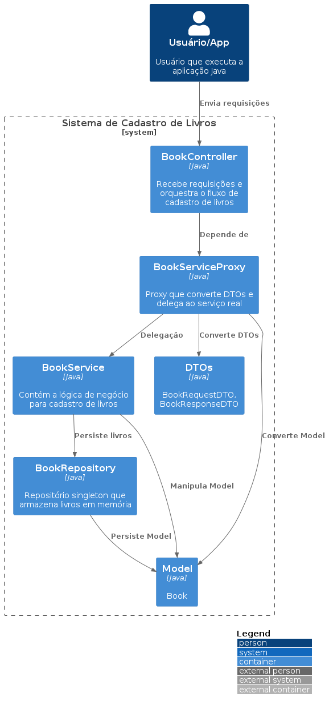

# Padrão Proxy e Boas Práticas em Java Puro

Este projeto demonstra o uso do padrão de projeto **Proxy** em Java puro, com um cenário realista de cadastro de livros, além de aplicar boas práticas como DTOs, Repository Singleton e métodos de fábrica estáticos.

## Estrutura

- `realscenario.dto.BookRequestDTO` — DTO de entrada (request)
- `realscenario.dto.BookResponseDTO` — DTO de saída (response)
- `realscenario.model.Book` — Modelo de domínio
- `realscenario.repository.BookRepository` — Singleton que simula um repositório de livros
- `realscenario.service.IBookService` — Interface genérica para serviços
- `realscenario.service.BookService` — Implementação do serviço, usando método de fábrica estático
- `realscenario.service.BookServiceProxy` — Proxy que converte DTO ↔ Model e delega ao serviço real
- `realscenario.controller.BookController` — Controller que só lida com DTOs
- `realscenario.app.ScenarioApp` — Classe principal para rodar o exemplo

## Fluxo

1. O App cria o controller, passando o proxy como dependência.
2. O controller recebe um DTO de request, chama o proxy.
3. O proxy converte o DTO para model, delega ao serviço real, converte o resultado para DTO de response.
4. O serviço real salva o livro no repositório singleton.
5. O App imprime o resultado usando o DTO de response.

## Diagrama C4 - Nível Container



## Como executar

- **Modo fácil (recomendado):**

```sh
./run.sh
```

- **Modo manual:**

1. Compile os arquivos Java:

```sh
javac -d out src/main/java/realscenario/**/*.java
```

2. Execute a aplicação:

```sh
java -cp out realscenario.app.ScenarioApp
```

## Como gerar e executar o JAR

- Após compilar o projeto (ou rodar ./run.sh), gere o JAR com:

```sh
./build-jar.sh
```

- Execute o JAR gerado:

```sh
java -jar app.jar
```

## Padrões e técnicas aplicadas

- **Proxy:** Centraliza conversão DTO ↔ Model e delega ao serviço real.
- **DTO:** Facilita comunicação desacoplada entre camadas.
- **Repository Singleton:** Simula persistência centralizada.
- **Static Factory Method:** Inicialização controlada de serviços e repositórios.

## Referência

- [Refactoring Guru — Proxy em Java](https://refactoring.guru/pt-br/design-patterns/proxy/java/example)

> **Observação:** Os scripts `run.sh` e `build-jar.sh` foram feitos para ambientes Linux/Unix. No Windows, recomenda-se usar Git Bash, WSL ou adaptar os comandos para batch/powershell.